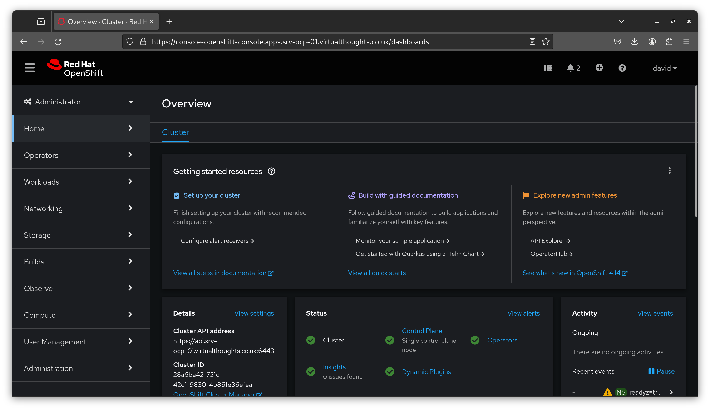

# Manage OpenShift Container Platform

## Use the web console to manage and configure an OpenShift cluster

Users logged into the web console are usually select between two different views

### Administrator View



* **Focus**: Geared towards cluster management and configuration.  
* **Features**:  
  * Comprehensive control over all aspects of the OpenShift cluster.  
  * Ability to manage cluster resources, user access, and permissions.  
  * Tools to monitor cluster health, resource usage, and performance metrics.
  * Access to advanced settings like cluster settings, node configuration, storage management, and network policies.
  * Management of Operators, which are software extensions to Kubernetes that make use of custom resources.
  * Capabilities to view and manage workloads, but with a broader scope than in the Developer view, including across namespaces.
* **Target Users**: System administrators and IT professionals responsible for maintaining the OpenShift cluster.

### Developer View


* **Focus**: Primarily focused on application development.
* **Features**:
  * Simplified interface for building and deploying applications.
    Access to application-centric views, such as Topology, where you can see the components of your applications and how they are connected.
  * Ability to create and manage workloads like DeploymentConfigs, Pods, and Services.
  * Access to project-specific resources like Routes, Builds, and Pipelines.
  * Tools for monitoring application performance and health.
  * Integrated view for code repositories, builds, deployments, and more, to streamline the development process.  
* **Target Users**: Developers who are mainly concerned with writing and deploying code.

## Use the command-line interface to manage and configure an OpenShift cluster

The `oc` can be considered a superset of `kubectl` - it includes all the capabilities of `kubectl` along with additional features specific to Openshift.

To log into a cluster with `oc`

```bash
oc login https://my-cluster.example.com:6443 -u myusername -p mypassword
```

Or to log in using a token, extrapolate the login command:


Once authenticated, query as desired:

```bash
# Retrieve list of openshift projects
oc get projects

# List current client configuration
oc status

# Switch to a different project
oc project my-other-project

# Create an app from a source code repo
oc new-app https://github.com/sclorg/nodejs-ex.git

# Describe a pod
oc describe pod my-pod-name

etc..
```

## Query, format, and filter attributes of Kubernetes resources

### Querying

`oc get` and `oc describe` can be used to query Kubernetes objects much like `kubectl`

```bash
# Get Objects
oc get pods
oc get svc
oc get deployments

# Describe an object
oc describe pod $name
oc describe svc $name
oc describe deployment $name
```

### Formatting

You can customize the output format using the `-o` option. Common output formats include `json`, `yaml`, `wide`, `name`, and custom columns.

```bash
# Format output in JSON
oc get pods -o json

# List pods with custom columns
oc get pods -o custom-columns=NAME:.metadata.name,STATUS:.status.phase
```

### Filtering

Kubernetes resource `labels` can be used as a basis for filtering output via `-l`. For example, to get Pods with a specific label:

```bash
oc get pods -l app=my-app
```

For more complex queries, you can use JSONPath templates with the -o option.

```bash
# Get Pod names via specifying `jsonpath`
oc get pods -o=jsonpath='{.items[*].metadata.name}' -A

# Get only Running pods based on stats.phase value
oc get pods -o=jsonpath='{.items[?(@.status.phase=="Running")].metadata.name}' -A
```

## Import, export, and configure Kubernetes resources

### Importing

`oc apply -f <filename.yaml>` or `oc apply -f <url>`

### Exporting

```bash
oc get <resourceType> <ResourceName> -o yaml > <filename.yaml>
```

### Editing / Configuring

```bash
# Edit a resource directly - note some values are immutable
oc edit <resourceType>/<resourceName>

# Set an env variable
oc set env deployment/<deploymentName> <KEY>=<VALUE>

# Scale a Deployment
oc scale deployment/<deploymentName> --replicas=<number>
```

## Locate and examine container images

```bash
# Locate
oc get images

# Examine
oc describe image <image-name-or-hash>
```

## Create and delete projects

```bash
# Create a Project
oc new-project <projectName>

# Delete a Project
oc new-project myProject
```

## Examine resources and cluster status

```bash
# Check Cluster Version and Health
oc get clusterversion

# Check Cluster nodes and status
oc get nodes

# Examine resources
oc get/describe resourcetype/resourcename
```

## View logs

```bash
# Supported resources for oc logs are builds, build configs (bc), deployment configs (dc), and pods

oc logs resourceType/ResourceName
```

## Monitor cluster events and alerts

```bash
# Get cluster wide events
oc get events -A

# Get namespace scoped events
oc get events -n <namespace>

# Get events for a specific resource type
oc get events --field-selector involvedObject.kind=Pod
```

## Assess the health of an OpenShift cluster

```bash
# Check Cluster Operators
oc get clusteroperators

# Check Nodes
oc get nodes

# Check Resource usage
oc adm top nodes
oc adm top pods --all-namespaces

# Check network policies and routes
oc get networkpolicy --all-namespaces
oc get routes --all-namespaces
```

Also check for out of the box exposed Prometheus metrics and Grafana dashboards.

## Troubleshoot common container, pod, and cluster events and alerts

This is largely covered in preceeding topics, `oc get/describe/logs/adm` can be leveraged for a plethora of troubleshooting scenarios.

## Use product documentation

[Leverage the Documentation as and when required](https://docs.openshift.com/container-platform/4.14/welcome/index.html)